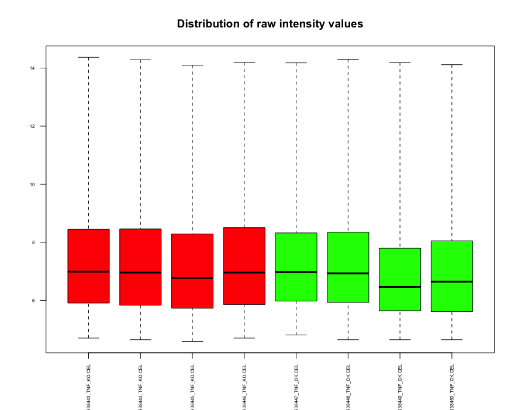
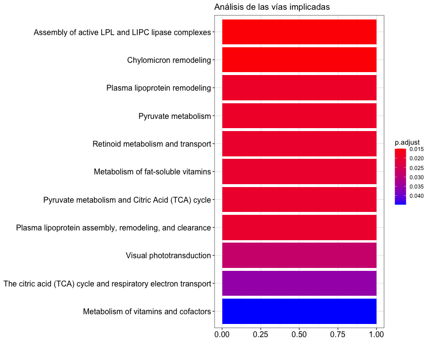

  <h1>
  Análisis de Datos Ómicos PEC_1 
  </h1>

Iago Lastra Rodríguez (iagolast@uoc.edu) 

<page-break></page-break>

[TOC]

## Abstract

## Objetivos

Aunque los inhibidores de factores de necrosis tumoral [TNF](https://es.wikipedia.org/wiki/Factor_de_necrosis_tumoral) son [utilizados en el tratamiento de enfermedades inflamatorias crónicas](https://www.ncbi.nlm.nih.gov/pubmed/15370396) no existe demasiada información acerca de cómo pueden afectar estos tratamientos al funcionamiento normal del sistema nervioso central.

En este trabajo se analizarán Microarrays de ARN para buscar diferencias estadísticamente significativas entre muestras sin tratar (WT) y muestras sometidas a tratamientos de inhibición de TNF.

## Materiales y Métodos

Este trabajo se basa en estúdio de comparación de grupos (class comparison) donde se han tomado muestras correspondientes al dia 13.5 de la fase embrionaria (E13.5) al séptimo día de vida (P7) y en adultos de 2 y 4 meses de vida (A2 y A4 respectivamente) de un grupo de control (WT) de ratones [C57BL/6](https://en.wikipedia.org/wiki/C57BL/6) y un segundo grupo de ratones tratados (TNF-/-).

Los microarrays utilizados son del modelo GeneChip Mouse Gene 1.0 ST Array de Affymetrix que según su especificación contienen aproximadamente 25 sondas (probes) diseñadas para cubrir 28,853 genes bien conocidos y anotados.

### Procedimiento de trabajo

En un primer paso se analizaron gráficamente los archivos .CEL buscando posibles errores en los datos. Aunque tanto el histograma como el boxplot mostraron datos bastante uniformes se realizó una comprobación adicional utilizando el paquete `arrayQualityMetrics` para verificar que los datos no contenían errores.

#### Normalización

Para poder realizar un análisis de la expresión diferencial de los datos es necesario transformar los datos para que sean comparables entre sí. 

Esta transformación se ha realizado utilizado el algorimo Robust Multichip Analysis (RMA) que a grandes rasgos corrige el ruido de forndo, normaliza los datos y realiza una estimación final de la intensidad.

Una vez obtenidos los datos normalizados se repite el control de calidad sobre los mismos.

#### Filtrado

Para eliminar el ruido consecuencia de la variabilidad aleatoria en los datos se ha utilizado la función `nsFilter` del paquete `genefilter` para descartar los genes con menor variabilidad.

#### Selección de genes

Para escoger los genes se han utilizado dos aproximaciones estadísticas. 

Por un lado se ha realizado un t-test (`rowttest`) y por otro se ha utilizado el método de Smyth (`limma`) visto en prácticas previas.

Dado el grán número de genes que se tienen en cuenta se ha aplicado una corrección sobre el p-valor de los genes seleccionados mediante el t-test. Dado que estamos dispuestos a asumir una cantidad de falsos positivos a cambio de maximizar los genes candidatos para el posterior análisis de significación biológica, se ha optado por el método de Benjamini & Hochber.

Los genes seleccionados y su significación han sido.

|SYMBOL        |        BH|
|:-------------|---------:|
|9430060I03Rik | 0.0431307|
|Gm10787       | 0.0431307|
|Gm10024       | 0.0431307|
|Gm11696       | 0.0431307|
|Dnmt3aos      | 0.0491421|
|Gm10782       | 0.0431307|
|BC025933      | 0.0431307|
|Gm10536       | 0.0431307|
|Gm10532       | 0.0431307|
|Gm10857       | 0.0431307|
|Gm10804       | 0.0491421|
|Gm10714       | 0.0431307|
|Oog3          | 0.0431307|
|Gm10369       | 0.0431307|
|Gm10445       | 0.0491421|
|Gm10610       | 0.0431307|
|Fam129c       | 0.0431307|
|Gm10655       | 0.0431307|

Por otra parte, los genes seleccionados mediante regresión lineal son:

| **PROBE_ID** | SYMBOL  | adj.P.Val |
| :----------- | :------ | --------: |
| 10423836     | Cthrc1  | 0.0311910 |
| 10418205     | Plac9b  | 0.0311910 |
| 10566326     | Trim12a | 0.0311910 |
| 10471675     | Glo1    | 0.0311910 |
| 10398432     | Mir377  | 0.0311910 |
| 10572130     | Lpl     | 0.0361161 |
| 10412394     | Nnt     | 0.0410250 |

#### Interpretación biológica de los resultados

Con esto se ha podido realizar un análisis enrich dando como resultado las siguientes vías:

## Resultados

...

## Discusión

- Los dos métodos dan vias diferentes que a la vez son diferentes a las del propio paper.

## Apéndice

==TODO: Link al repo==

**Estudio:**  https://www.ncbi.nlm.nih.gov/geo/query/acc.cgi?acc=GSE134178

**ID_DATA**: GSE134178

**BioProject:** https://www.ncbi.nlm.nih.gov/bioproject/PRJNA554146